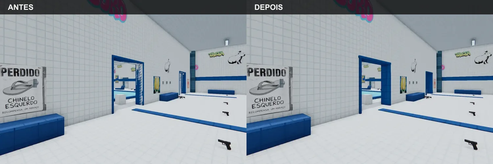
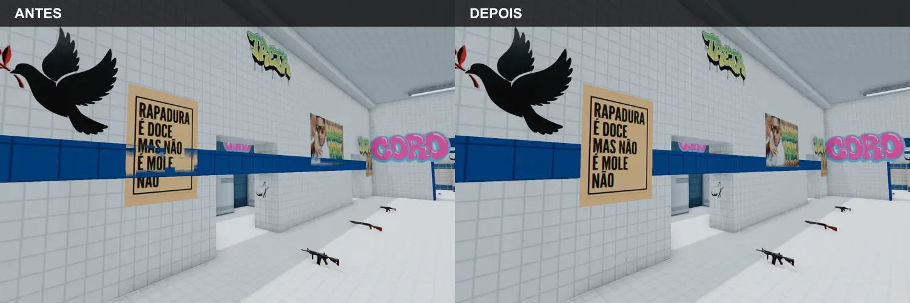

# Piscina: cintilação das molduras e faixas azuis

## Objetivo e definição de pronto

Eliminar os fragmentos brancos e azuis que mudavam com a câmera nas molduras dos
vestiários e na faixa horizontal da Piscina da Treta. A correção fica pronta quando:

- moldura, parede, faixa e decalques ocupam planos separados;
- as peças visuais não criam colisão nem projetam sombra na superfície onde estão presas;
- a régua passa no mapa real e o mutante que restaura a geometria antiga reprova;
- a comparação 3:2 fica limpa com e sem o batch de geometria.

## Relato e entrada

Relato literal do dono em 09/10/2026:

> "essa parte da fase com o azul esta com um glitch."

A entrada foi `/Users/ruben/Documents/screen/Screenshot 2026-10-09 at 00.00.39 (2).png`,
5.603.718 bytes, SHA-256
`c2aba6d94f67fffdf34f5466c63669ad2ce7e0273e6a64962a6216752a5b483b`.

O `AGENTS.md` aponta defeitos conhecidos para `../progress/KNOWN-BUGS.md`, mas esse
arquivo não existe no checkout atual. Este relatório em `docs/reports/` é o ledger
versionado desta correção.

## Causa medida

A moldura vertical terminava exatamente no plano lateral do vão e o travessão começava
exatamente no plano inferior da parede: folga de 0 m. A faixa horizontal tinha a face a
0,06 m da parede e os decalques a 0,08 m, deixando só 0,02 m entre os planos.

O batch não era a causa. A mesma falha apareceu com o batch ligado e com
`?piscinaBatch=0`.

## Correção

- Batentes avançam 0,04 m no vão e ficam 0,10 m à frente da parede.
- Travessão avança 0,04 m para dentro do vão.
- Faixa passa a 0,03 m da parede. Os decalques mantêm 0,08 m, com 0,05 m de separação.
- As 22 peças de acabamento usam `collide: false` e `castShadow: false`.

Arquivos de runtime e régua:

- `public/js/map_piscina.js`
- `tools/eval/piscina-trim-check.mjs`
- `package.json`, script `eval:piscina-trim`, chamado por `check:deploy` e `check:fast`

## Evidência antes e depois



SHA-256: `705d0efe6b1be0e4aa1c4e123c3ad64723247cc57a01a7e6d6ec8d2a61513591`.



SHA-256: `8b9f7a46845687d705e84f58c583285b7fe45e188c17d5740660c43ff2dbeedd`.

As capturas foram feitas em Chrome/WebGL a 1500 x 1000. A passada foi repetida com o
batch ligado e desligado. As imagens acima usam o batch ligado, o mesmo caminho padrão do jogo.

## Régua e contraprova

Comando normal:

```text
node tools/eval/piscina-trim-check.mjs
PASSA PZT1
PASSA PZT2
PASSA PZT3
```

Medidas: batente/vão 0,04 m; travessão/vão 0,04 m; moldura/parede 0,10 m;
faixa/parede 0,03 m; faixa/decalque 0,05 m. PZT1 deriva essas cinco medidas das
dimensões e posições das malhas efetivamente criadas: as 22 caixas de acabamento,
6 caixas sobre os vãos, 10 caixas das paredes externas e 171 planos de decalque.
As 22 peças registraram zero colisores adicionados e `castShadow=false`.

Contraprova:

```text
node tools/eval/piscina-trim-check.mjs --mutante=coplanar
FALHA PZT1
PASSA PZT2
PASSA PZT3
```

O mutante conserva a declaração corrigida (`declarationUnchanged=true`) e restaura as
posições e espessuras antigas apenas no caminho que constrói as caixas: batente/vão
0 m, travessão/vão 0 m e faixa/decalque 0,02 m. A evidência vem dos parâmetros da
geometria e da posição de cada malha depois de `addBox`; só PZT1 fica vermelho. Isso
prova que uma regressão na construção reprova mesmo se a declaração do layout continuar nova.

## Estado de integração

- Branch: `fix/piscina-trim-zfight-20261009`
- PR: `corosolto/client#800`
- Base preparada: `5616414e78d8e752260c47096f967e9fdca176f0` (`v2.1.0-alpha.60`)
- Próximo passo: integrar o #800 e recompor #790 e #791 sobre a nova `main`.
