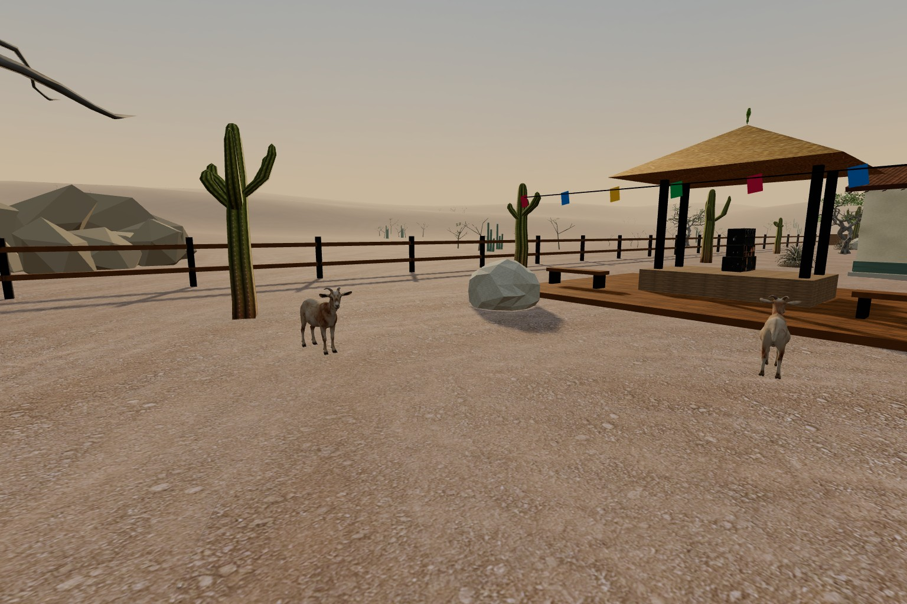
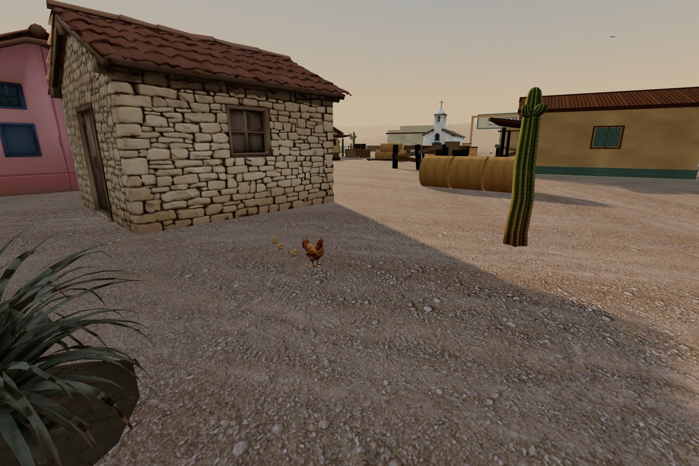

# Criação do Sertão — integração local de 06/09/2026

O dono reportou: “os assets de galinha gerado no mint gg e bode etc nao vi no
mapa ainda”. A configuração ainda carregava a galinha antiga; os novos modelos
estavam apenas no projeto Mint. A captura inicial e a régua LG1 confirmaram
ausência dos caprinos e da família: `artifacts/sertao-astra/livestock-before/`.

## Resultado observado

Dois caprinos perto da praça de forró, uma galinha e três pintinhos no terreiro.
Os caprinos usam o mesmo modelo com escala/ciclo distintos; não são dois modelos
anatômicos de sexos diferentes. Low conserva um caprino, mãe e dois pintinhos.
São decoração sem colisão, dano ou áudio novo. Rotas e objetivos não mudaram.

Capturas originais1536×1024, PNGs e vídeos em
`artifacts/sertao-astra/livestock-final/`. Cópia compacta versionada em
`tools/eval/asset-evidence/sertao-criacao/`, com dois vídeos de16s e três sheets.
Os vídeos incluem caminhada, pausa e retomada; o recibo registra relógio,
estados, velocidades e os hashes dos três GLBs. Não são animações geradas em2D.

Fonte, prompt, termos Mint e recibo de download:
[SERTAO-FAUNA2-ASSETS.md](SERTAO-FAUNA2-ASSETS.md). Rigs e Walk/Idle feitos
localmente em Blender; a geração Mint era estática. Registro final em
`mint-assets.json` e `public/models/ambient/FONTE.md`; checkpoint dos assets
`c9b05881`. Reimportação confirmou Y-up/frente+Z, metros, clipes e hashes.

## Régua, correções e evidência técnica

- LA1–LA4: GLB real, procedência/hash, rig/clipes, textura e URL com cache por
  conteúdo. Cinco mutantes rejeitados: rig, clipe ou textura removidos, bytes
  alterados e cache antigo. Script `tools/eval/sertao-livestock-check.mjs`.
- LG1–LG8: Chrome carrega os arquivos finais; seis instâncias em normal,
  quatro emlow; deformação contínua;14.400 amostras de percurso sem empurrão por
  colisor; distância mínima7,645m de objetivo. Reset/dispose verificados.
  Script `tools/eval/sertao-livestock-runtime-check.mjs`.
- Descarte: a régua adicional comprovou LG8 vermelho antes da liberação dos
  boneTextures. Após a correção, seis texturas de ossos emnormal/quatro emlow
  são liberadas, com três recursos de contato e zero texturas de acervo
  descartadas. Nove mutantes de runtime rejeitados; `rig-nao-descartado`
  reproduz especificamente esse vazamento.
- R1 mostrou cascos sem contato visual. R2 acrescentou uma única malha
  instanciada com contato suave; o crítico confirmou escurecimento local sem
  disco artificial. A régua compara pixels com esse passe ligado/desligado;
  não basta um nome de objeto ou flag no relatório.
- A mutação de mixer parado revelou uma régua cega: mudança Idle→Walk contava
  como animação. A versão corrigida mede deformação apenas entre8–16s de Walk
  contínuo. O mutante de sombra atua depois da política final de fauna, que
  anulava a primeira tentativa de mutação. Ambos agora reprovam a cláusula certa.
- RV1–RV12 passaram com o mapa completo: máximo488 calls e352.776 triângulos
  nas vistas da régua. Os limites existentes503/368.208 não foram ampliados.
  A criação custa24.228 tris de modelos +12 tris de contato emnormal, sete
  meshes/passes e nenhuma sombra de rig; os três arquivos únicos somam1.282.720B.
- Partida real30s com sete bots e movimento normal: p50=8,3ms, p95=10,1ms,
  deslocamento65,51m, nenhum pageerror. A rodada anterior na main integrada
  media8,4/12,8ms; não é uma comparação estatística de hardware nem promessa
  de FPS em outros dispositivos. Counts da partida incluem pós-processamento
  e personagens e não são os counts do mapview usados no RV3.

Detalhes numéricos, SHAs servidos e dados da partida:
`tools/eval/asset-evidence/sertao-criacao/evidence.json`. Logs originais em
`artifacts/sertao-astra/logs/livestock-*`. As réguas de node e presença no
navegador foram conectadas aos respectivos workflows, com captura anexada no CI.

## Crítica e limites

O crítico independente aprovou os modelos e48 poses do trio congelado: silhuetas
reconhecíveis, corpo estável e patas sem fragmentos ou dobras invertidas visíveis.
A primeira tentativa da galinha tinha o eixo incorreto (Euler ignorado pelo modo
Quaternion). Os cortes experimentais foram descartados; a geometria adulta
final permanece inteira. O pintinho foi reduzido de4.910 para3.190tris com IoU
de silhueta≥0,99767 nas quatro vistas comparadas.

O crítico examinou também33 PNGs extraídos dos vídeos, incluindo quadros
adjacentes antes/depois das pausas: rumo, repouso, retomada e continuidade
corporal aprovados nessa amostragem, sem bloqueador observado. Ele não reproduziu
vídeo contínuo;2fps não certificam cadência, microdeslizamento ou a transição
de150ms. Os vídeos ficam disponíveis para a revisão humana desse limite.
O teste de percurso não substitui revisão humana sob combate.
Não houve merge nem deploy. O memorial de Padre Cícero permanece fora do mapa,
pois o candidato anterior foi reprovado; ver [SERTAO-MEMORIAL.md](SERTAO-MEMORIAL.md).
Atualização final com main225, checks globais e submissão limpa seguem no
[registro de continuação](SERTAO-CONTINUACAO.md).
