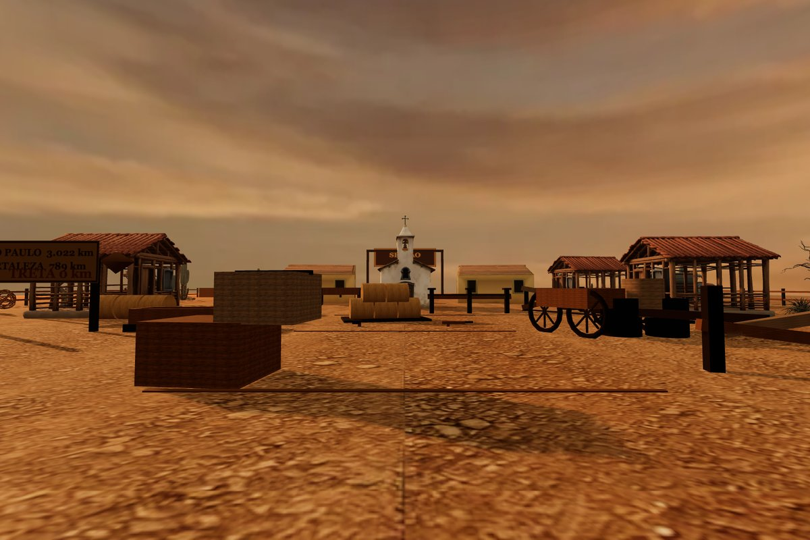
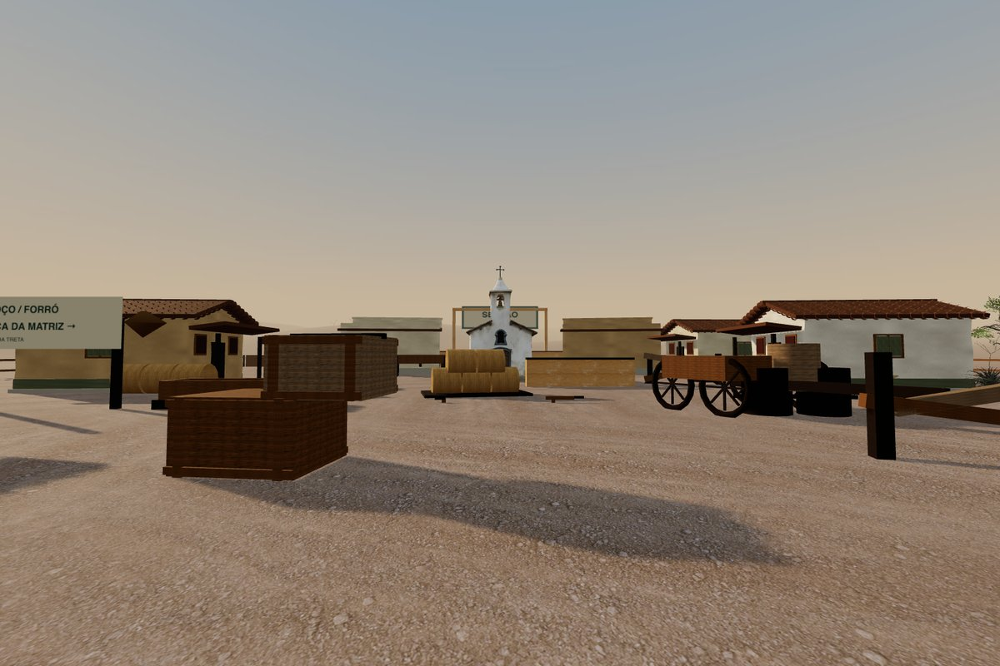
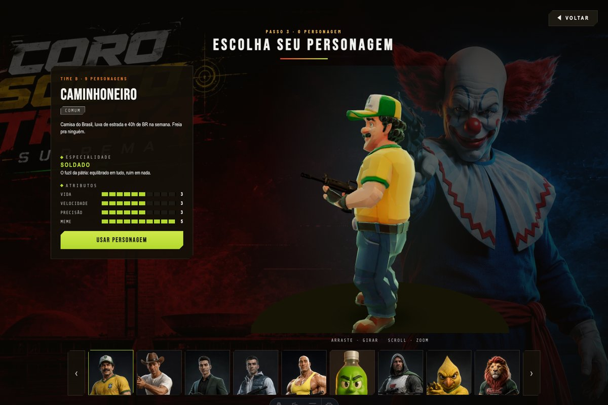
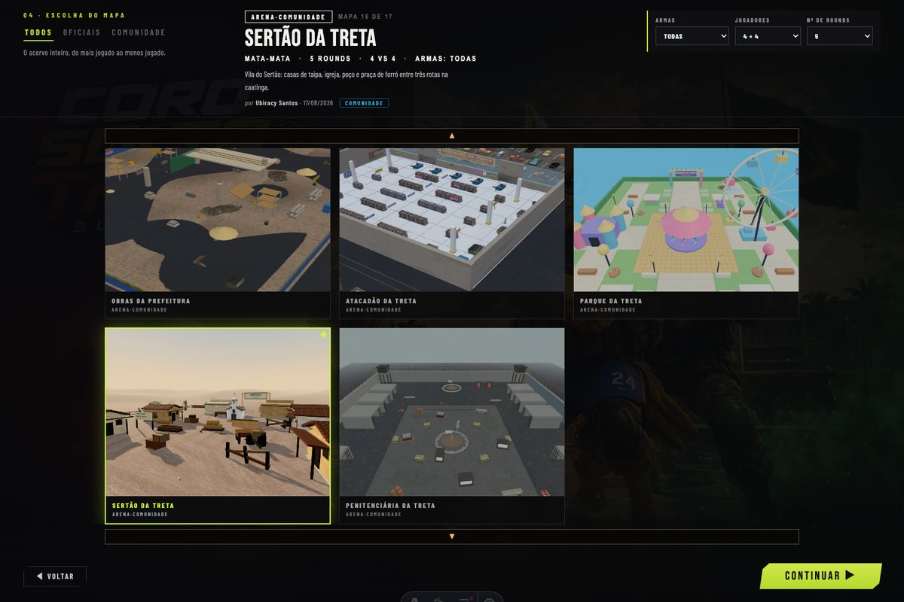
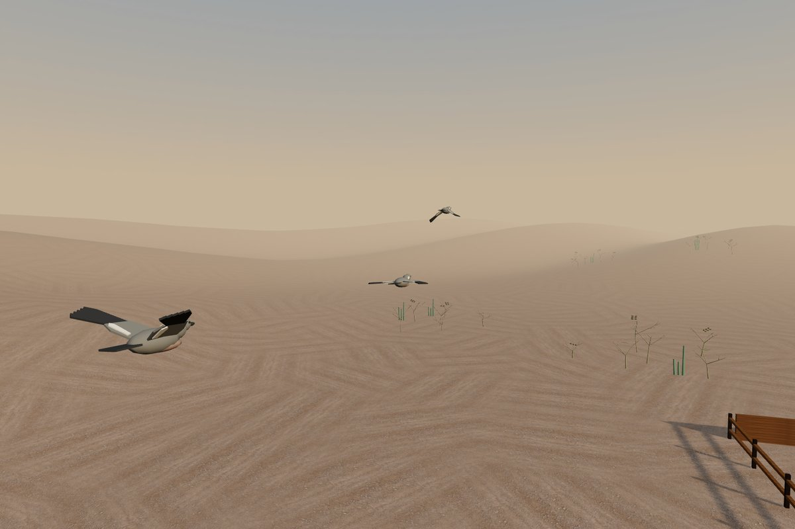
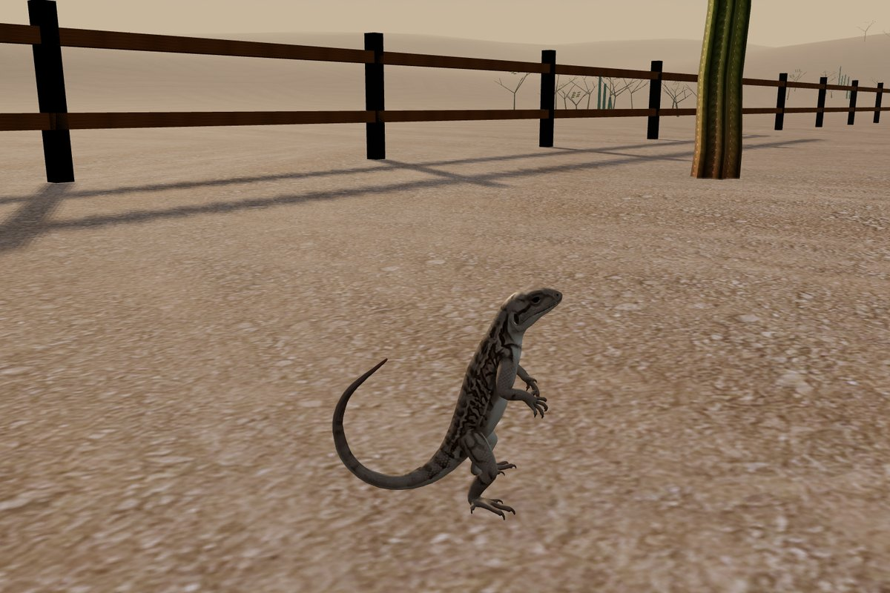

# Sertão: evidência para revisão humana

Capturas do jogo servido em Chrome/Metal, originalmente1536×1024, reduzidas para
1200×800 sem composição ou geração de imagem. Antes: PR445 em49441895. Depois:
runtime de1b29ab5f, preview45332cd2, menu495a6d88. Esta pasta não significa
aprovação visual final, liberação de assets ou autorização de publicação.

## Praça antes/depois




Casario com taipa/adobe, acabamento de telhas/venezianas, flora da Caatinga,
igreja e poço preservados; céu e solo sem a emenda inicial. Spawns e objetivos
preservados, colisão e oclusão corrigidas. A planície distante ainda tem padrão
repetitivo e a diferença de acabamento entre casas continua perceptível.

## Menu alinhado à main





Referência visual main69555790, sem transportar a dependência multiplayer.
O fluxo real chegou à partida com sete bots e nenhum erro JavaScript. O hover
de facção indisponível foi verificado sem CTA de entrada. Chrome headless não
travou o ponteiro: giro360 e combate com mouse exigem revisão em aba normal.

O [JPEG do Sertão](../../../../public/img/map-previews/velho_oeste.jpg) e o
[vídeo silencioso de seis segundos](../../../../public/img/map-previews/velho_oeste.mp4)
vêm de captura WebGL, ligada às fontes pelo
[recibo](../../../../public/img/map-previews/velho_oeste.capture.json).
Vídeo só carrega após hover/foco; pausa ao sair, navegar ou ocultar a aba.
Toque, economia de dados e movimento reduzido conservam o poster.

## Fauna




Três aves procedurais autorais, uma em low, com silhueta e asa branca orientadas
por referências naturais. Captura da ave anterior ao reparo do calango; código
da ave é o mesmo da revisão atual. Dois calangos adicionais em trajetórias
testadas. Nenhuma sombra ou oclusão sólida adicionada pela fauna.

Reparo do calango elimina uma face preta espúria, preservando materiais/pose.
A postura ereta e o movimento sem rig permanecem artificiais. O crítico aprovou
o reparo localizado, não o realismo completo do animal. Mint não estava autenticado:
nenhum novo asset foi gerado ou adquirido; procedência pendente do acervo herdado
permanece em FONTE/registro, sem inventar licença.

## Evidência técnica e reprodução

[evidence.json](evidence.json) guarda runtime12/12, fauna4/4, preview6/6, fluxo
e medição de30s com sete bots: p50=8,4ms, p95=10,6ms; 60,39m percorridos sem
erros JS. Não prova conclusão de todas as rotas nessa amostra de combate.
As três rotas físicas completas e contraprova de barreira estão no marco anterior.

Mapview atual:491calls/291060tris, dentro de503calls do baseline. A partida usa
outros passes e elenco;603,38calls/frame não é comparável diretamente ao mapview.

Na worktree exclusiva, com Node22+ e dependências instaladas:

```sh
npm run dev -- --host 127.0.0.1 --port 8149
BASE=http://localhost:8149 npm run eval:map-preview
BASE=http://localhost:8149 npm run eval:sertao-fauna-runtime
BASE=http://localhost:8149 npm run eval:sertao-runtime
npm run eval:sertao-fauna
npm run eval:calango-surface
npm run eval:map-preview-race
npm run eval:cinematic-ui -- --mutantes
```

Revisão interativa: `http://localhost:8149/?map=velho_oeste&lang=pt`, sem debug.
O harness estático8145 não renderiza os loops Astro do menu. Não usá-lo para
aprovar menu. Os resultados globais/pendências ficam no relatório da revisão.
